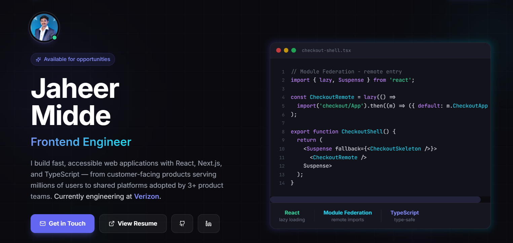

# Jaheer Midde - Portfolio

Frontend-focused developer portfolio for Jaheer Midde, a Software Engineer II and Frontend UI Lead working on e-commerce conversion, multi-product configuration, micro-frontends, and production reliability.

**Live site:** [jaheermidde.vercel.app](https://jaheermidde.vercel.app)



## Stack

- React 18 and TypeScript
- Vite
- Tailwind CSS
- Framer Motion
- Lucide React

## Product and content structure

- Hero: positioning, proof points, resume, and selected-work CTA
- About: engineering strengths, leadership style, and interests
- Skills: evidence-based core strengths and supporting tools
- Selected Work: production case studies and open-source projects
- Experience: career progression, outcomes, leadership, and education
- Contact: email, calendar invite, GitHub, LinkedIn, and CI status

Production case studies use anonymized descriptions and measurement context where employer-specific details cannot be published.

## Architecture

This is a single-page Vite application. `App.tsx` owns the page composition, while each major section is kept in its own component and loaded through React lazy boundaries. Portfolio content is centralized in `src/data/portfolio.ts`, and diagrams are self-contained responsive SVG components.

```text
src/
├── components/     Page sections, diagrams, and reusable UI
├── data/           Personal, skills, project, and experience
content
├── hooks/          Viewport and active-section behavior
├── utils/          Hash scrolling, calendar invites, and shared helpers
public/             Favicon, social preview, resume, robots.txt, and sitemap.xml
```

## Accessibility and performance

- Semantic sections and headings with a skip-to-content link
- Keyboard-visible focus states and accessible expandable project panels
- Mobile navigation with keyboard dismissal and focus restoration
- Reduced-motion-aware scrolling and Framer Motion configuration
- Responsive diagrams with text alternatives
- Initial JavaScript kept smaller with section-level code splitting
- Lighthouse CI and build/lint checks run through GitHub Actions

## Local development

```bash
npm ci
npm run dev
```

## Verification

```bash
npm run lint
npm run build
npm run preview
```

## Deployment

The site is deployed through Vercel from the canonical GitHub `main` branch. Vercel runs `npm run build` and serves the generated `dist/` directory. SPA fallback behavior is configured in `vercel.json`; static files in `public/` should remain directly accessible.

When updating content, edit `src/data/portfolio.ts`. Keep public assets in `public/`, update the canonical metadata in `index.html`, and verify `robots.txt`, `sitemap.xml`, resume access, and social previews after deployment.
